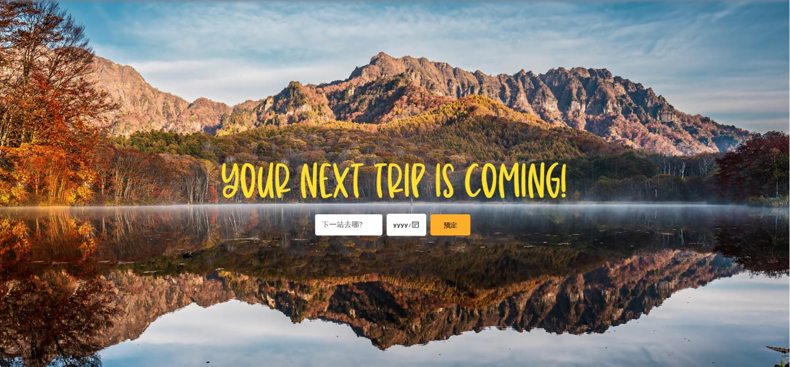
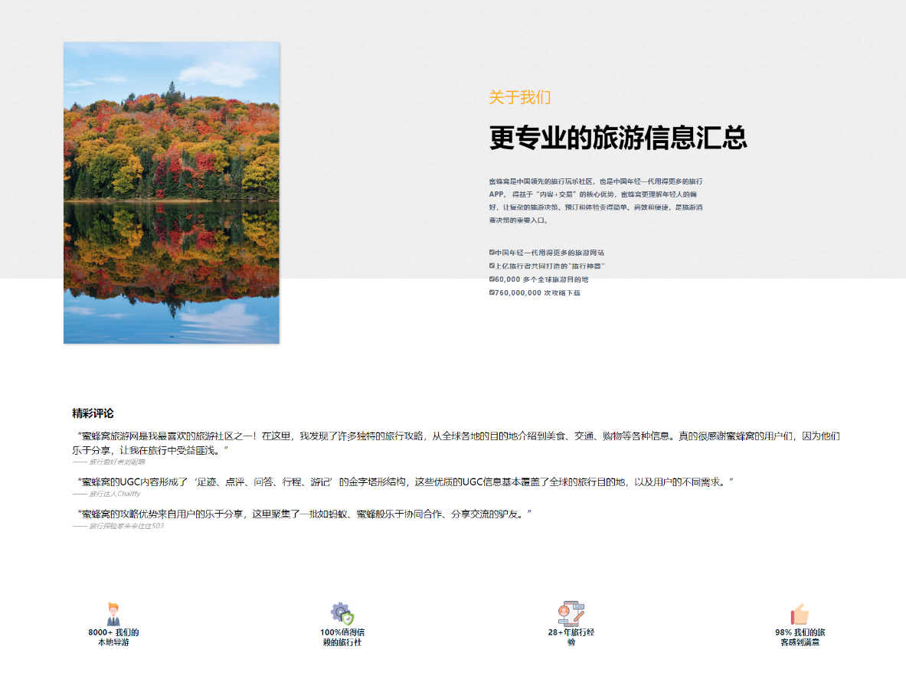
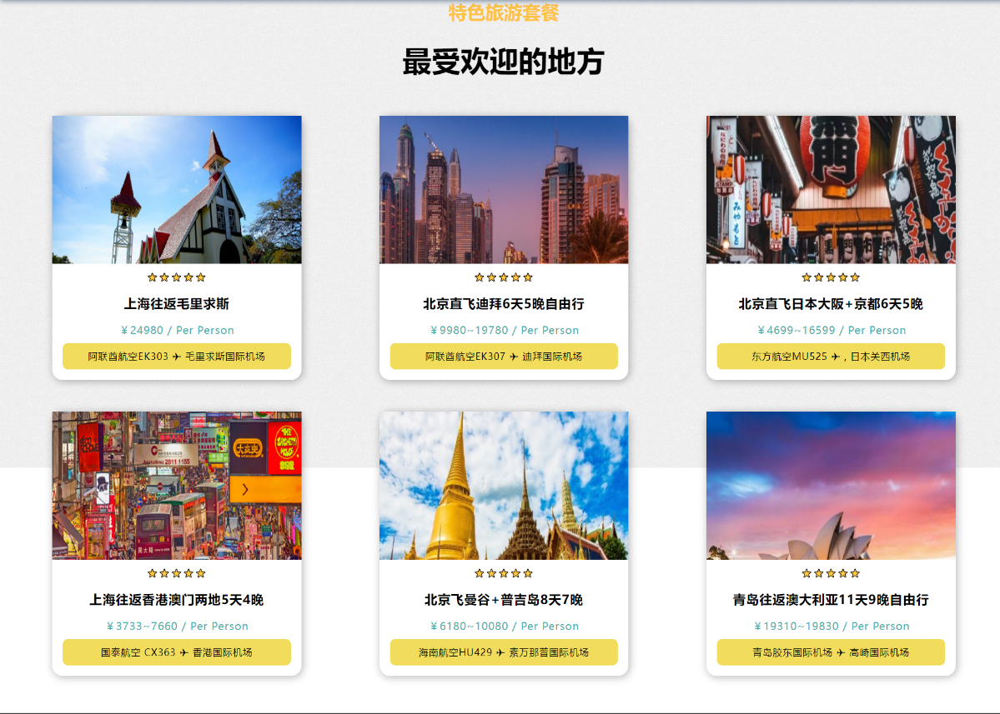
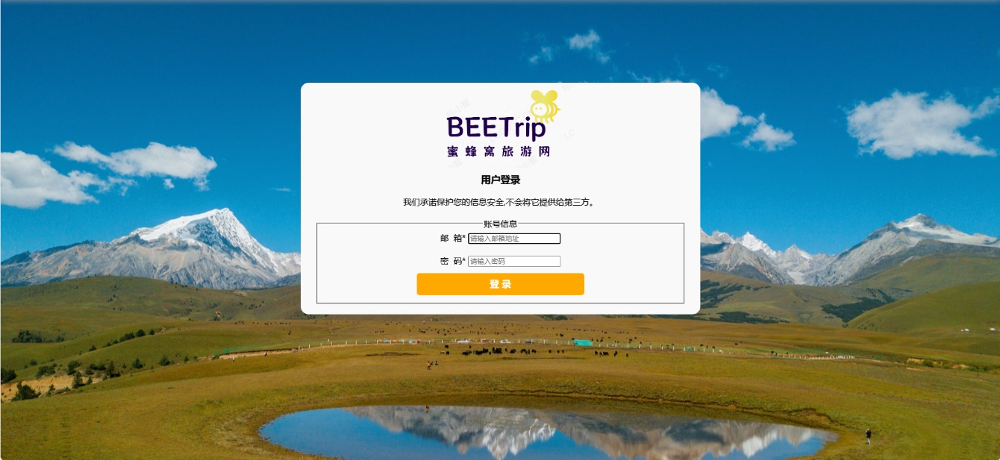
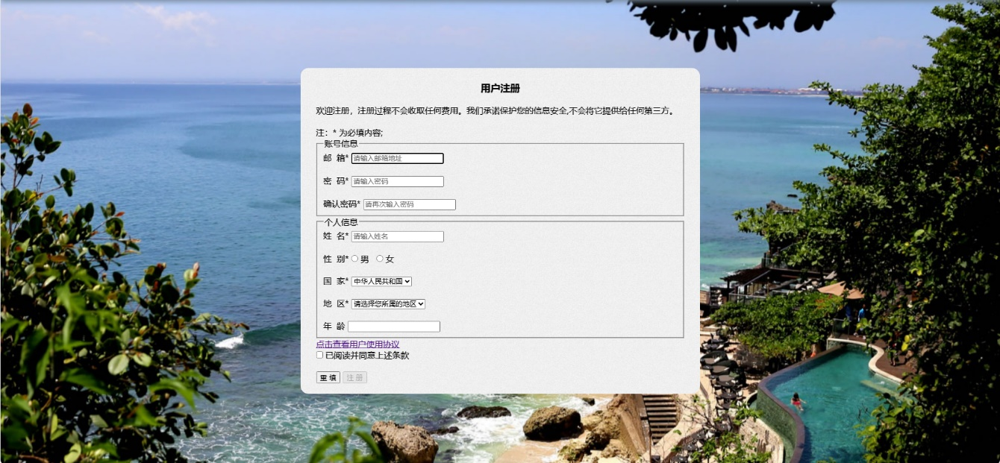

<h1 align="center">马蜂窝旅游网🥰🥰</h1>

  
  
  
  
  
  

## 背景:
  计算机网络技术的快速进步和互联网的普及，已经给人类生活带来了巨大的变化。越来越多的部门、企业和组织通过互联网来宣传自己，同时为有信息需求的人提供了便捷的服务。随着我国经济的快速发展，人们的生活水平得到了显著提高。假日经济和旅游经济已经成为人们消费的热点。各地也把旅游业作为本地经济发展的重要支柱之一，从而带动了其他经济产业的快速发展。旅游网站成为各旅游景点和旅行社宣传中不可或缺的工具，其内容对于旅游景点的宣传和旅游项目的决策起着非常重要的作用。在这种背景下，旅游、电子商务和互联网的快速融合将不可避免，并创造出难以估量的价值。网络旅游将推动旅游领域内的互联网电子商务迅速发展，也将为旅游业界带来新的生机。

## 功能：
- [x] 1主页模块
旅游路线搜索与订购：允许用户搜索旅游路线并进行订购，可能会调用到热门景点模块以获取相关信息。网站用户评价：提供用户评价和反馈功能，以及展示已有用户的评价信息。
网站自我介绍：包括关于网站的介绍、使命和愿景等内容。
- [x] 2热门景点模块
热门景点介绍：展示当前热门景点的详细信息，包括时间、地点、价格、时长等，并提供订购功能用于套餐的预订。
- [x] 3旅游攻略模块
官方或用户的旅游攻略：展示官方或用户编写的旅游攻略，同时配以图片和景点介绍。
- [x] 4联系我们模块
网站联系方式：提供网站的联系方式，包括服务热线、服务邮箱、品牌市场部、流量合作、商务合作以及全球总部地址等信息。
- [x] 5登录/注册模块
用户信息获取：用于用户登录和注册，以获取用户信息并进行套餐订购和优惠推送。
这些模块将通过导航栏中的链接标签进行调用，用户可以通过导航栏直接访问和切换这些功能模块。在网站的设计和实现过程中，这些模块将相互关联，以提供全面的旅游服务和信息展示。

## 预览:

#### Buy Me a Coffee，你的赞赏将会给我带来更多动力。或者动动小手点个小星星🥰

## 特别感谢
授课老师
